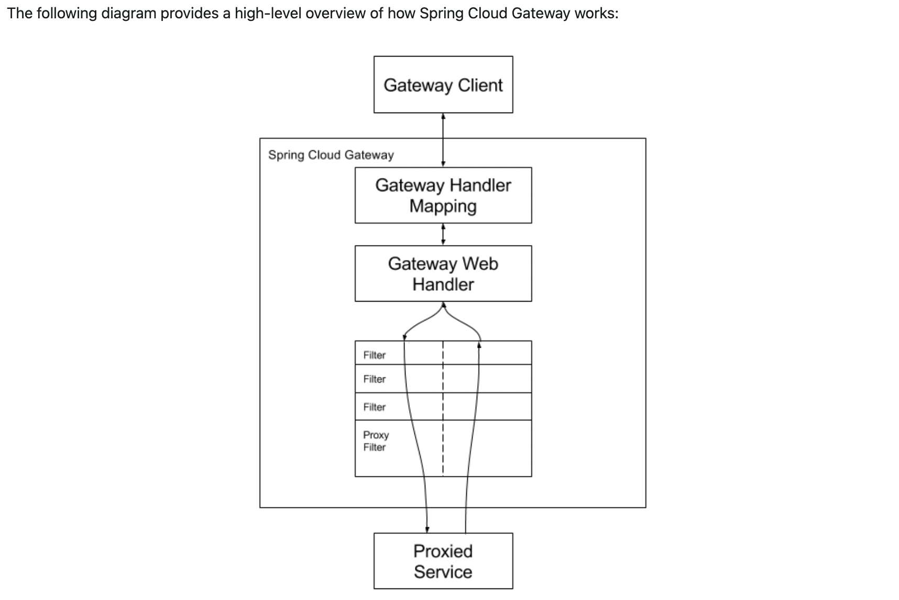

# Gateway Service

Spring Cloud Gateway provides a library for building an API Gateway on top of Spring WebFlux. Spring Cloud Gateway aims to provide a simple, yet effective way to route to APIs and provide cross-cutting concerns to them such as: security, monitoring/metrics, and resiliency.

Spring Cloud Gateway features:
- Built on Spring Framework 5, Project Reactor and Spring Boot 2.0
- Able to match routes on any request attribute.
- Predicates and filters are specific to routes.
- Circuit Breaker integration.
- Spring Cloud DiscoveryClient integration
- Easy to write Predicates and Filters
- Request Rate Limiting
- Path Rewriting

## How it works

**Glossary:**
- **Route**: The basic building block of the gateway. It is defined by an ID, a destination URI, a collection of predicates, and a collection of filters. A route is matched if the aggregate predicate is true.
- **Predicate**: This is a Java 8 Function Predicate. The input type is a Spring Framework ServerWebExchange. This lets you match on anything from the HTTP request, such as headers or parameters.
- **Filter**: These are instances of GatewayFilter that have been constructed with a specific factory. Here, you can modify requests and responses before or after sending the downstream request.



## Gateway Service Demo

To keep things simple we are going to use a public API so that we can focus on the Gateway Service. We will use the following public API:

[JsonPlaceholderService](http://jsonplaceholder.typicode.com)

Create you first route by adding the following to the `application.yml` file:

```yaml
spring:
  cloud:
    gateway:
      routes:
        - id: all-posts
          uri: http://jsonplaceholder.typicode.com
          predicates:
            - Path=/posts
```

```yaml
spring:
  cloud:
    gateway:
      routes:
        - id: all-posts
          uri: http://jsonplaceholder.typicode.com
          predicates:
            - Path=/blog
          filters:
            - SetPath=/posts
```

Add a second route to the `application.yml` file:

```yaml
spring:
  cloud:
    gateway:
      routes:
        - id: all-posts
          uri: http://jsonplaceholder.typicode.com
          predicates:
            - Path=/blog
          filters:
            - SetPath=/posts
        - id: post-by-id
          uri: http://jsonplaceholder.typicode.com
          predicates:
            - Path=/blog/{id}
          filters:
            - SetPath=/posts/{id}
            - AddResponseHeader=X-Response-Default-Foo, Default-Bar
```

- View the [Route Predicate Factories](https://docs.spring.io/spring-cloud-gateway/docs/current/reference/html/#gateway-request-predicates-factories). 
- View the [GatewayFilter Factories](https://docs.spring.io/spring-cloud-gateway/docs/current/reference/html/#gatewayfilter-factories).
- View the [Fluent Java Routes API](https://docs.spring.io/spring-cloud-gateway/docs/current/reference/html/#fluent-java-routes-api) 


## Resources 

- [Spring Cloud Gateway](https://spring.io/projects/spring-cloud-gateway)
- [Spring Cloud Gateway Reference Guide](https://docs.spring.io/spring-cloud-gateway/docs/current/reference/html/)
